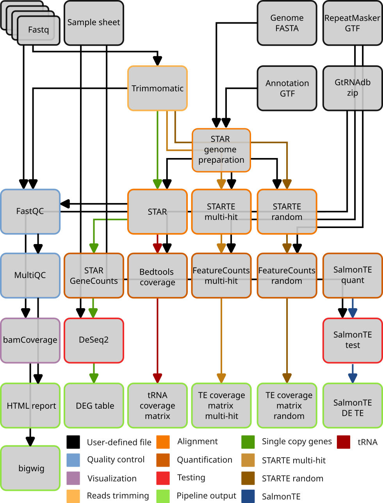
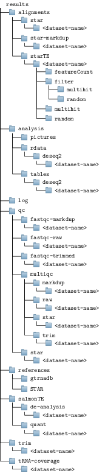

# 3t-seq: automatic gene expression analysis of single copy genes, transposable elements and tRNAs

## Overview

This is a Snakemake workflow for the integrated analysis of single copy genes, transposable elements and tRNAs. It performs standard quality control checks and genome alignment in three different ways specialized either for single copy genes or transposable elements. It then quantifies gene expression depending on how the alignement step was performed. Finally it performs differential gene expression analysis yielding lists of genes significantly deregulated between two given conditions.

<p align="center">

</p>

## Requirements


- [Conda](https://conda.io/)
- [Snakemake](https://snakemake.readthedocs.io/en/stable/)
- [Apptainer](https://apptainer.org/docs/user/latest/)

## Usage

### 1. Download the latest version of the pipeline

For example, to download version 1.0.0:

```bash
curl -LJO "https://github.com/boulardlab/3t-seq/archive/v1.0.0.zip"
unzip "3t-seq-1.0.0.zip"
```

### 2. Create a conda environment

```bash
conda create -n snakemake-latest -c bioconda -c conda-forge snakemake singularity
conda activate snakemake-latest
```

### 3. Configure samples and parameters

Edit the `config.yaml` file to specify your sample information and analysis parameters. The [`config/` folder](config/) contains a detailed description of this file.

### 4. Execute the pipeline

```bash
snakemake --profile profile/default
```

### 5. View results

After the pipeline completes, you can find the results in the `results/` directory.

### 6. Generate 3t-seq HTML report

After successful execution, an interactive HTML report collecting execution statistics, FastQC and MultiQC reports, DESeq2 results, MA plot and Volcano plots for single copy gene, retrotransposons and tRNAs can be generated as follow:

```bash
snakemake --profile profile/default --report report.zip
```

A `report.zip` archive will be generated in the current working directory. The archive will contain the HTML file. This file can be shared and does not need internet connection to be opened.

## Configuration

Adjust parameters in the `config.yaml` file to match your experimental setup. See `config/README.md` for further instructions.


### Sample sheet preparation

The sample sheet is a csv file that describe samples metadata:

- The `sample` column reports a human readable name for each sample.
- For pe libraries, `filename_1` and `filename_2` columns report file names for each of the two
sequencing reads mates. For se libraries, `filename` is sufficient. **The pipeline will use these columns to determine if a given dataset was sequenced with pe or se method**.
- The `genotype` column reports the variable of interest. The name of this column is flexible and can be anything as long as you specify what's this name in the config file (in the `deseq2` section).


## Directory Structure

The pipeline will generate an ouput folder tree like so

<p align="center">
  
</p>

## Run tests

The `tests/` folder contains a small test dataset and example configuration file needed to run the 3t-seq pipeline on it. 

Provided a working Snakemake installation is available, the example dataset can be run as follow:

```bash
cd 3t-seq
snakemake \
  --directory tests \
  --configfile tests/config.yaml \
  --profile tests/profile \
  --snakefile workflow/Snakefile
```

Results will then be available in `tests/results`.

An example 3t-seq HTML report could be generated with the following command:

```bash
snakemake \
  --directory tests \
  --configfile tests/config.yaml \
  --profile tests/profile \
  --snakefile workflow/Snakefile \
  --report report.zip
```

The `report.zip` file will be generated in `tests/report.zip`.

## References

Tabaro F, Boulard M, *3t-seq: automatic gene expression analysis of single copy genes, transposable elements and tRNAs from total RNA-seq data*, Under review.

## License

This project is licensed under the [MIT License](LICENSE).
