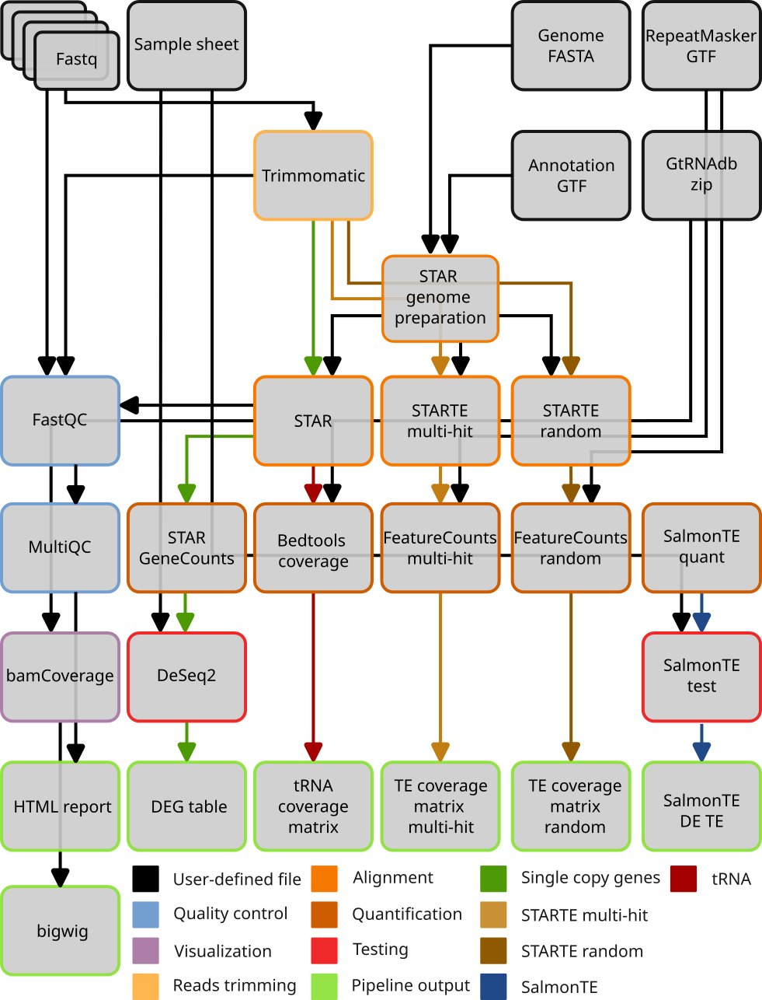
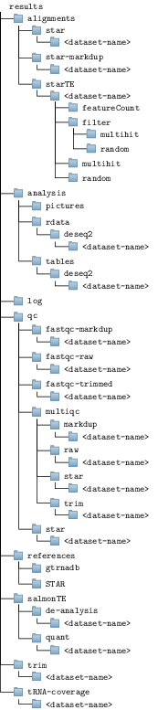

# 3t-seq: automatic gene expression analysis of single copy genes, transposable elements and tRNAs

## Overview

This is a Snakemake workflow for the end-to-end analysis of single copy genes, transposable elements and tRNAs. It performs standard quality control checks and genome alignment in three different ways specialized either for single copy genes or transposable elements. It then quantifies gene expression depending on how the alignement step was performed. Finally it performs differential gene expression analysis yielding lists of genes significantly deregulated between two given conditions.

<p align="center">

</p>

## Quickstart

The easiest way to run 3t-seq and access its documentation is using [Pixi](https://pixi.sh).

1. **Clone the repository**:
   ```bash
   git clone https://github.com/boulardlab/3t-seq.git
   cd 3t-seq
   ```

2. **Serve the documentation**:
   ```bash
   pixi run docs-serve
   ```
   This will start a local server at `http://127.0.0.1:8000` with the complete manual.

3. **Verify installation**:
   ```bash
   pixi run -e dev test
   ```
   This runs a small integration test to ensure everything is set up correctly.

## Requirements

- [Pixi](https://pixi.sh/) (Recommended for automated environment management)
- [Apptainer](https://apptainer.org/docs/user/latest/) or [Docker](https://www.docker.com/) (For containerized tool execution)

## Usage

### 1. Configure samples and parameters

Edit the `config.yaml` file. The [`config/` folder](config/) contains a README with common patterns, and the [Full Configuration Guide](docs/configuration/index.md) provides exhaustive details.

### 2. Execute the pipeline

Run the default pipeline using:
```bash
pixi run snakemake --profile profile/default
```

*Note: 3t-seq uses predefined environments (`default`, `dev`, `docs`). The `pixi run` command automatically handles all dependencies.*

### 3. Generate 3t-seq HTML report

After successful execution, generate an interactive HTML report:
```bash
pixi run snakemake --profile profile/default --report report.zip
```

## Configuration

Adjust parameters in the `config.yaml` file to match your experimental setup. See `config/README.md` for further instructions.

### Automatic Resource Allocation

3t-seq automatically calculates the necessary computing resources (threads, memory, and runtime) based on the size of your input FASTQ files and the known requirements of tools like STAR and featureCounts.

- **Memory**: STAR is allocated base memory for the genome index (~32GB for human/mouse) plus dynamic memory for sorting proportional to input size.
- **Runtime**: Scaled linearly with the size of the compressed input reads.
- **Threads**: Optimized for different pipeline stages (8 threads for alignment, 4 for quantification).

### Custom Genome References

If you prefer to provide your own explicit FASTA and GTF reference files rather than having them downloaded automatically via Refgenie, you can omit the `label` parameter and provide `fasta_path` and `gtf_path` instead in `config.yaml`:

```yaml
genome:
  fasta_path: /absolute/path/to/your/genome.fa
  gtf_path: /absolute/path/to/your/annotation.gtf
  salmonte_species: mm # "mm", "hs", "dr", or "dm"
```

The pipeline will automatically apply necessary pre-processing to these files (like enforcing `chr` nomenclature and subsetting chromosomes) just like it does with Refgenie downloads. Make sure to specify `salmonte_species` to define the target species for SalmonTE quantification since the `label` parameter is missing.

### Sample sheet preparation

The sample sheet is a csv file that describe samples metadata:

- The `name` column reports a human readable name for each sample.
- For pe libraries, `filename_1` and `filename_2` columns report file names for each of the two
sequencing reads mates. For se libraries, `filename` is sufficient. **The pipeline will use these columns to determine if a given dataset was sequenced with pe or se method**.
- The `genotype` column reports the variable of interest. The name of this column is flexible and can be anything as long as you specify what's this name in the config file (in the `deseq2` section).


## Directory Structure

The pipeline will generate an ouput folder tree like so

<p align="center">
  
</p>

## Run tests

The repository includes an integration test suite. You can run it using the pre-defined Pixi tasks:

```bash
# Run the integration test
pixi run -e dev test

# Generate a report for the test run
pixi run -e dev test-report
```

For more advanced testing options, see the [Testing Documentation](docs/getting-started/index.md#running-tests).

## References

Tabaro F, Boulard M, *3t-seq: automatic gene expression analysis of single copy genes, transposable elements and tRNAs from total RNA-seq data*, Under review.

## License

This project is licensed under the [MIT License](LICENSE).
