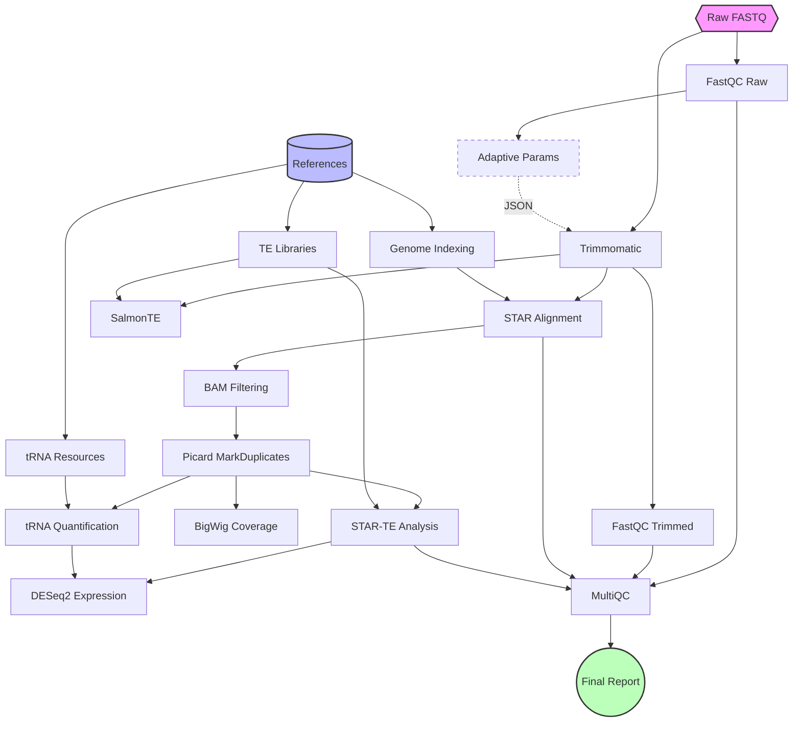

# 3t-seq Manual

Welcome to the **3t-seq** documentation.

3t-seq is a robust, automated Snakemake pipeline designed for end-to-end total RNA-seq analysis, with specialized modules for tRNA and transposable element (TE) processing.

## At a Glance

- **Easy to use**: Simplified configuration and environment management via [Pixi](https://pixi.sh).
- **Reproducible**: Container-native execution with Apptainer/Docker.
- **Comprehensive**: Handles everything from quality control to differential expression.
- **Scalable**: Runs on local machines or high-performance computing (HPC) clusters.

## Workflow Overview

## Navigation

- [Getting Started](getting-started.md): Installation and your first run.
- [Configuration](configuration.md): Detailed guide on how to set up your analysis.
- [Usage](usage.md): Commands and workflows.
- [Deduplication](deduplication.md): Understanding the deduplication strategy.
