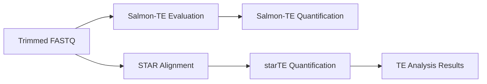

# Transposable Element (TE) Analysis

The Transposable Element module provides identification and quantification of TE transcripts using two complementary methods.

## Overview

Transposable elements are highly repetitive, making them challenging to quantify. The 3t-seq pipeline addresses this with specialized alignment and quantification strategies.

## Workflow

## Methods

### starTE Analysis

starTE uses STAR for alignment and a specialized counting algorithm for multi-mapping reads.

- **Random Match**: Randomly assigns multi-mapping reads to a single locus.
- **Multi-mapping Allocation**: Uses **fractional counting** to distribute multi-mapping reads equally across all valid alignment loci (each locus receives \(1/n\) of a count for a read mapping to \(n\) locations).

### SalmonTE Analysis

[SalmonTE](https://github.com/hyunhwan-bcm/SalmonTE) is a fast and accurate quantification method for TE transcripts.

- Uses quasi-mapping to quickly assign reads to a curated database of TE consensus sequences.
- Highly efficient for large datasets.

## Parameters & Defaults

### starTE Random

| Parameter | Default | Description |
| :--- | :--- | :--- |
| `outFilterMultimapNmax` | `5000` | Support for highly repetitive elements. |
| `winAnchorMultimapNmax` | `5000` | Max number of multimaps for a single window. |

### starTE Multihit

| Parameter | Default | Description |
| :--- | :--- | :--- |
| `outFilterMultimapNmax` | `1` | Only uniquely mapped reads for fractional calculation. |
| `featureCounts --fraction` | `true` | Enables fractional counting logic. |

---

## Results

| Location | Description |
| :--- | :--- |
| `results/alignments/starTE/` | STAR-TE quantification results and log files. |
| `results/salmonTE/` | SalmonTE quantification results. |
| `results/analysis/rdata/` | Normalized TE counts for downstream analysis. |
| `results/analysis/tables/` | Tabular summaries of TE expression. |
