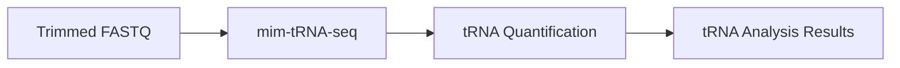

# tRNA Analysis

The tRNA Analysis module provides precise quantification and modified coverage assessment for tRNA species.

## Overview

tRNA genes are densely modified and highly repetitive, requiring specialized alignment strategies to avoid mapping biases.

## Workflow

## tRNA Quantification

The pipeline implements the [mim-tRNA-seq](https://github.com/nedialkova-lab/mim-tRNAseq) strategy for quantifying tRNA abundance.

### Features

- Optimized for heavily modified tRNA sequences.
- Dynamic alignment parameters.
- Comprehensive annotation from GtRNAdb.

### tRNA Annotation

The pipeline uses annotations from [GtRNAdb](http://gtrnadb.ucsc.edu/), which are highly curated and provide detailed information on tRNA isoacceptors and isodecoders.

## Parameters & Defaults

| Parameter | Default | Description |
| :--- | :--- | :--- |
| `method` | `standard` | Choice between `standard` and `mim-tRNA-seq`. |
| `mimseq_params.max_mismatches` | `2` | Max mismatches for mim-tRNA-seq alignment. |
| `mimseq_params.cluster_identity` | `0.8` | Identity threshold for clustering tRNAs. |

---

## Results

| Location | Description |
| :--- | :--- |
| `results/tRNA_coverage/` | tRNA coverage maps and quantification results. |
| `results/analysis/rdata/` | Normalized tRNA counts for downstream analysis. |
| `results/analysis/tables/` | tRNA-specific quantification tables. |
| `results/references/gtrnadb/` | Down-loaded tRNA annotations. |
